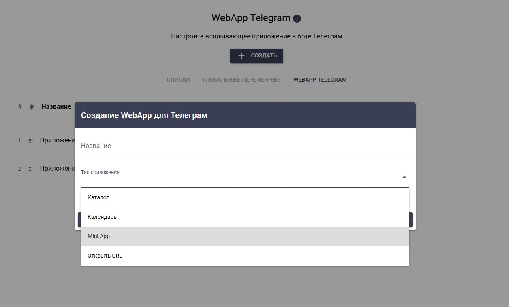
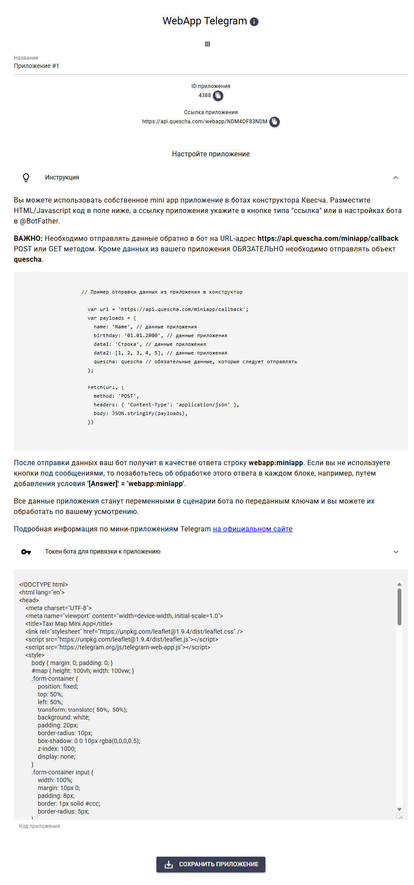
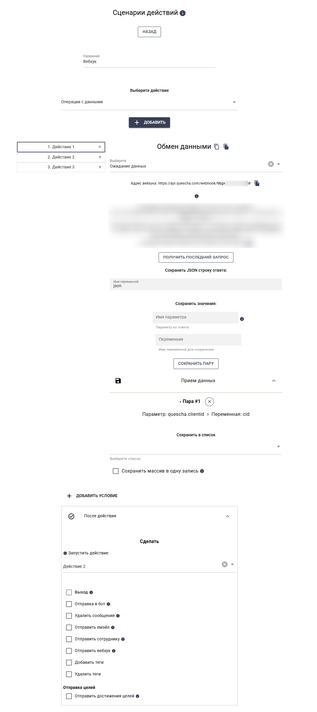

# Mini App

В конструктор можно добавить свой код мини приложения

<figure><figcaption></figcaption></figure>

<figure><figcaption></figcaption></figure>

Код мини-приложений можно сгенерировать с помощью нейросетей, например, grok, deepseek, chatgpt и т.д. Учитывайте, что данные из приложения в бот нужно отправлять на адрес [https://api.quescha.com/miniapp/callback](https://api.quescha.com/miniapp/callback) POST или GET методом. Вместе с вашими данными нужно отправить объект quescha, который создается при запуске мини-приложения вне его.

Если вы хотите загружать какие-то данные из бота в приложение при запуске или в процессе работы приложения, то необходимо настроить сценарий действий с действием Обмен данными -> Ожидание данных. В этом действии вы получите вебхук, на который нужно обращаться из приложения. В дальнейших действиях вы формируете данные для загрузки в приложение и помещаете их в переменную #{\_response} (Чаще всего в виде JSON объекта).

Удобнее всего хранить данные в списках конструктора, к ним вы сможете обратиться через действие Операции с данными, а сформировать переменную #{\_response} в нужном формате с помощью действия JS код.

Также при загрузке первоначальных данных, нам может потребоваться персонализация, для этого нам нужно узнать ClientID подписчика бота, который запустил мини-приложение. Эти данные можно получить, отправив из приложения объект quescha (также window.quescha) и принять их в действии Ожидание данных. В нем же мы получаем URL вебхука, по которому делаем запрос из приложения. Объект quescha содержит в себе следующие данные:

```json
// Объект quescha
{
    "webappid":4 // id web приложения в конструкторе
    "channelid":5 // id бота в конструкторе
    "clientid":254104321 // идентификатор подписчика бота - ClientID в конструкторе - User ID в Телеграме
}
```

<figure><figcaption></figcaption></figure>

Также вы можете разместить свое мини-приложение в @BotFather -> Bot Settings -> Configure Mini App и сделать его основным способом взаимодействия с подписчиками вашего бота.

## Подробно в видео на Ютуб/Рутуб




